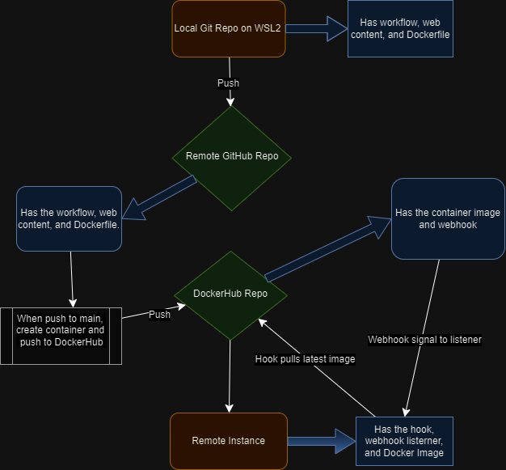

# Project Description: 
  - Implemented semantic versioning into the github workflow using git tag.
  - Utilized webhooks to automatically deploy new container images on an AWS instance.
  - [Link to original project description from course](https://github.com/pattonsgirl/CEG3120/tree/main/Projects/Project5)

## Diagram:
- Here's a diagram illustrating the continuous deployment process.
  - Utilized draw.io to visualize the CD pipeline.
  - Labeled tools used and connections between components.


## Part 1 - Semantic Versioning
### 1. How to create and and why to use a git tag:
  - First to create a tag, use the `git tag` command followed by the name of the tag you want to create. Here's a basic example:

```bash
git tag v1.0
```

This command creates a lightweight tag named "v1.0" at the current commit. Lightweight tags are essentially just a pointer to a specific commit.

To create an annotated tag, which includes additional information such as a message, you can use the `-a` flag along with the `-m` flag to specify the tag message:

```bash
git tag -a v1.0 -m "Release version 1.0"
```

This command creates an annotated tag named "v1.0" with the message "Release version 1.0".

After creating a tag, you can push it to your remote repository by running the `git push` command and the name of your tag:

```bash
git push origin <tagname>
```

Replace `<tagname>` with the name of the tag you want to push. If you want to push all tags, you can use the `--tags` option:

```bash
git push origin --tags
```

This command pushes all tags to the remote repository. If you remote repo isnt named origin you can replace it with the name of the remote repo that you are using. 

Creating tags can be useful for marking releases or important points in your Git history. 

### 2. Updated GitHub Action workflow to:
   - Run when a tag is pushed.
   - Utilized docker/metadata-action to generate tags.
   - Pushed images to DockerHub with tags based on git tag version and `latest`.

This next step involves the integration of the **GitHub workflow**. This workflow is an enhancement of the previous one, with the crucial addition of the `docker-metadata@v5` action.

Upon modification, the workflow performs the following operations:

1. **Activation**: The workflow is triggered upon the push of a tag that adheres to the `v*.*.*` format.
2. **Repository Checkout**: It proceeds to check out your GitHub repository.
3. **Dockerhub Tag Generation**: The workflow generates Dockerhub tags using the repository/image_name and specific patterns. In this context, the 'version' pattern utilizes the entire `*.*.*` tag, the 'major.minor' pattern employs `*.*`, and the 'major' pattern uses `*`.
4. **Docker Image Construction**: The Docker image is built based on the current commit and is tagged with the generated tags.
5. **Image Upload**: Finally, the tagged images are uploaded to Dockerhub.

This workflow ensures a streamlined process for Docker image creation, tagging, and upload, providing a robust solution for continuous integration and deployment. It's particularly beneficial for projects that require frequent updates or have multiple contributors. The use of semantic versioning (`v*.*.*`) allows for clear and organized tracking of different versions of the Docker images. The `docker-metadata@v5` action is instrumental in this process, enabling dynamic generation of Docker tags based on the GitHub tags. This ensures consistency and traceability between your GitHub repository and Dockerhub images.

---
## Part 2 - Deployment
Summary:
1. Installed Docker on an EC2 instance.
2. Pulled and ran a container from DockerHub image.
3. Created a script to pull a new image from DockerHub and restart the container.
4. Set up a listener/hook using adnanh's webhook to receive messages.
5. Configured DockerHub to send messages to the listener/hook.

## Deployment Process
### Docker Installation on Your Instance
To install Docker on an Ubuntu AWS instance, Docker's official documentation provides the following steps:

1. **Update APT and Install Required Packages**: Run the following commands in sequence to update APT, install the necessary certificates and curl, and create a directory for APT keyrings:
    ```
    sudo apt-get update
    sudo apt-get install ca-certificates curl
    sudo install -m 0755 -d /etc/apt/keyrings
    ```

2. **Add Docker's Official GPG Key**: Download Docker's official GPG key and save it to the APT keyrings directory:
    ```
    sudo curl -fsSL https://download.docker.com/linux/ubuntu/gpg -o /etc/apt/keyrings/docker.asc
    sudo chmod a+r /etc/apt/keyrings/docker.asc
    ```

3. **Add Docker Repository to APT Sources**: Add the Docker repository to APT sources with the following command:
    ```
    echo \
    "deb [arch=$(dpkg --print-architecture) signed-by=/etc/apt/keyrings/docker.asc] https://download.docker.com/linux/ubuntu \
    $(. /etc/os-release && echo "$VERSION_CODENAME") stable" | \
    sudo tee /etc/apt/sources.list.d/docker.list > /dev/null
    sudo apt-get update
    ```

4. **Install Docker and Its Components**: Install Docker and its components from APT with the following command:
    ```
    sudo apt-get install docker-ce docker-ce-cli containerd.io docker-buildx-plugin docker-compose-plugin
    ```

At this point, Docker should be running. You can verify this with `systemctl` or Docker's own `hello-world` container.

### Container Restart Script Setup
The [deployment script](deployment/deployment.sh) performs the following operations:

1. **Kill and Remove Existing Container**: The script begins by terminating and removing the specified container.
2. **Pull Fresh Image from Dockerhub**: It then pulls a fresh image from Dockerhub.
3. **Start New Image**: Finally, it starts the new image in detached mode and sets it to auto-restart.

### Installation and Configuration of Adnanh's Webhook
To install webhook on Ubuntu, simply run `sudo apt install webhook`. If webhook is not available in `apt`, you would need to build it from source.

Next, create a `hooks.json` file. The location does not matter as it is specified later. In my setup, it is stored in `/home/ubuntu`. The hooks file contains an `id`, `execute-command`, and `command-working-directory`:

- `id`: The name of the webhook to be called later.
- `execute-command`: The command that the hook runs when called. In this case, it's the path to the deploy script.
- `command-working-directory`: The working directory used when the script is executed.

Once you have a `hooks.json` file, you can start your webhook with `webhook --hooks /path/to/hooks.json --verbose`.

To start the webhooks automatically, you need to create a service file like [this](deployment/webhook.service). This file should be named `webhooks.service` and placed in `/etc/systemd/system`. The file needs three sections:

- `Unit`: Specifies the service description.
- `Service`: Contains the webhook start command.
- `Install`: Contains `WantedBy=multi-user.target`, which specifies where in the startup process to start this service.

With that in place, you can now manage the webhook service with the following commands:

- `sudo systemctl daemon-reload`: Reloads systemctl, allowing it to see the service file changes.
- `sudo systemctl start webhook.service`: Starts the service. Needs to be run at least once.
- `sudo systemctl status webhook.service`: Allows you to see if it's running and view the logs when a hook is triggered.

To add this webhook to GitHub, go to your repository settings and to the webhooks section. Add the webhook link, which is `ip.of.aws.instance:9000/hooks/hook_id`, and configure the conditions in which you want it to trigger, in this case, on workflow run. This completes the setup of the webhook for continuous integration and deployment.

---
## Helpful commands:
Here is a list of  commands for Git tags, Docker, GitHub Actions, and Docker Hub that will help with version control, containerization, CI/CD workflows, and image management:

### Git Tags:
- **Create a Tag:** `git tag <tagname>` creates a lightweight tag with the given name. `git tag -a <tagname> -m "Tag message"` creates an annotated tag with a message.
- **List Tags:** `git tag` lists all tags in the repository.
- **Show Tag Information:** `git show <tagname>` shows the commit that was tagged along with other information related to the tag.
- **Push Tags to Remote:** `git push origin <tagname>` pushes a specific tag to the remote repository. `git push origin --tags` pushes all tags to the remote repository.
- **Delete a Tag Locally:** `git tag -d <tagname>` deletes a specific tag from the local repository.
- **Delete a Tag on Remote:** `git push --delete origin <tagname>` deletes a specific tag from the remote repository.

### Docker:
- **Build Docker Image:** `docker build -t <image-name>:<tag> .` builds a Docker image with the specified name and tag using the Dockerfile in the current directory.
- **Run Docker Container:** `docker run -d <image-name>:<tag>` runs a Docker container in detached mode using the specified image.
- **List Docker Images:** `docker images` lists all Docker images on the local machine.
- **List Docker Containers:** `docker ps` lists all running Docker containers.
- **Stop Docker Container:** `docker stop <container-id>` stops a running Docker container.
- **Remove Docker Container:** `docker rm <container-id>` removes a Docker container.
- **Remove Docker Image:** `docker rmi <image-name>:<tag>` removes a Docker image.

### GitHub Actions:
- **Workflow Syntax Checking:** `github action syntax workflow.yml` checks the syntax of a GitHub Actions workflow file.
- **Trigger a Manual Workflow Dispatch:** This triggers a GitHub Actions workflow manually. You can find this option on the GitHub UI under the "Actions" tab.
- **Workflow Logs:** You can view workflow logs in the GitHub UI under the "Actions" tab.

### Docker Hub:
- **Login to Docker Hub:** `docker login` logs into Docker Hub using your credentials.
- **Push Docker Image to Docker Hub:** `docker push <image-name>:<tag>` pushes a Docker image to Docker Hub.
- **Pull Docker Image from Docker Hub:** `docker pull <image-name>:<tag>` pulls a Docker image from Docker Hub.
  
## Helpful commands pt. 2
Here is an appended list of addional helpful commands that are more advanced but just as useful as the previously listed basic commands:
### Git Tags:

- **List Tags with Commit Hashes:**
  ```bash
  git show-ref --tags
  ```

- **Push All Tags to Remote:**
  ```bash
  git push origin --tags
  ```

- **Checkout a Specific Tag:**
  ```bash
  git checkout tags/<tagname>
  ```

- **Search for Tags by Pattern:**
  ```bash
  git tag -l "pattern*"
  ```

### Docker:

- **Build Docker Image with Build Args:**
  ```bash
  docker build --build-arg <key>=<value> -t <image-name>:<tag> .
  ```

- **Run Docker Container with Port Mapping:**
  ```bash
  docker run -d -p <host-port>:<container-port> <image-name>:<tag>
  ```

- **Inspect Docker Container:**
  ```bash
  docker inspect <container-id>
  ```

- **Prune Unused Docker Resources:**
  ```bash
  docker system prune
  ```

### GitHub Actions:

- **View Workflow Run Logs:**
  ```bash
  gh run view <workflow-run-id>
  ```

- **List Workflow Runs:**
  ```bash
  gh run list
  ```

- **Cancel a Workflow Run:**
  ```bash
  gh run cancel <workflow-run-id>
  ```

### Docker Hub:

- **Inspect Docker Image:**
  ```bash
  docker image inspect <image-name>:<tag>
  ```

- **List Docker Hub Repositories:**
  ```bash
  curl -u <username>:<password> https://hub.docker.com/v2/repositories/<username>
  ```

- **Delete Docker Image from Docker Hub:**
  ```bash
  curl -X DELETE -u <username>:<password> https://hub.docker.com/v2/repositories/<username>/<repository>/tags/<tag>/
  ```
**These additional commands should provide further functionality and control over Git tags, Docker containers and images, GitHub Actions workflows, and Docker Hub repositories.**

---
## Resources:
- https://semver.org/
- https://github.com/adnanh/webhook
- https://docs.docker.com/engine/install/ubuntu/
- https://git-scm.com/book/en/v2/Git-Basics-Tagging
- https://docs.docker.com/build/ci/github-actions/manage-tags-labels/


